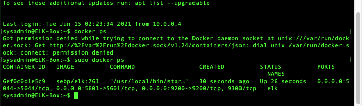

# INTRODUCTION
This repository primarily addresses the development and deployment of an ELK stack monitoring system within an Azure-based Cloud environment.
- All neccessary scripts and config files are located within the 'Ansible' Directory
- The 'Linux' directory contains several useful security scripts and an initial setup script to aid in establishing a new Linux-based system.

Below is a detailed description the ELK stack deployment proccess.

## Automated ELK Stack Deployment

The files in this repository were used to configure the network depicted below.

These files have been tested and used to generate a live ELK deployment on Azure. They can be used to either recreate the entire deployment pictured above. Alternatively, select portions of the complete-deploy_playbook.yml file may be used to install only certain pieces of it, such as Filebeat.

This document contains the following details:
- Description of the Topology
- Access Policies
- ELK Configuration
  - Beats in Use
  - Machines Being Monitored
- How to Use the Ansible Build

### Description of the Topology

The main purpose of this network is to expose a load-balanced and monitored instance of DVWA, the D*mn Vulnerable Web Application.

Load balancing ensures that the application will be highly available, in addition to restricting access to the network.

Integrating an ELK server allows users to easily monitor the vulnerable VMs for changes to the file system and system metrics.

The configuration details of each machine may be found below.

| Name                 | Function            | IP Address | Operating System   |
|----------------------|---------------------|------------|--------------------|
| Jump-Box-Provisioner | Gateway             | 10.0.0.4   | Linux Ubuntu 20.04 |
| Web-1                | DVWA Container      | 10.0.0.5   | Linux Ubuntu 20.04 |
| Web-2                | DVWA Container      | 10.0.0.6   | Linux Ubuntu 20.04 |
| Web-3                | DVWA Container      | 10.0.0.7   | Linux Ubuntu 20.04 |
| ELK-Box              | ELK Stack Container | 10.1.0.4   | Linux Ubuntu 20.04 |

### Access Policies

The machines on the internal network are not exposed to the public Internet. 

Only the Jump-Box-Provisioner machine can accept connections from the Internet. Access to this machine is only allowed from the following IP addresses:
"Personal IP"

Machines within the network can only be accessed by Jump-Box-Provisioner @ 10.0.0.4.

A summary of the access policies in place can be found in the table below.

| Name                 | Publicly Accessible | Allowed IP Addresses        |
|----------------------|---------------------|-----------------------------|
| Jump-Box-Provisioner | Yes                 | "Personal IP"               |
| Web-1                | No                  | 10.0.0.4                    |
| Web-2                | No                  | 10.0.0.4                    |
| Web-3                | No                  | 10.0.0.4                    |
| ELK-Box              | Yes                 | 10.0.0.4 "Personal IP":5601 |

### Elk Configuration

Ansible was used to automate configuration of the ELK machine. No configuration was performed manually, which is advantageous because this method ensures future scalability with ease while also allowing for a swift deployment of the ELK VM should it need to be rebuilt.

The playbook implements the following tasks:
- Install Docker & establish python environment
- Increase allocated virtual memory for ELK service 
- Download & launch ELK container
- Ensure persistence of docker service following a reboot

The following screenshot displays the result of running `docker ps` after successfully configuring the ELK instance.

### Target Machines & Beats
This ELK server is configured to monitor the following machines:
- Web-1 @ 10.0.0.5
- Web-2 @ 10.0.0.6
- Web-3 @ 10.0.0.7

We have installed the following Beats on these machines:
- Filebeat
- Metricbeat

These Beats allow us to collect the following information from each machine:
- 'Filebeat' generates and organizes log files for output to Logstash and the ELK stack as a whole. 'Filebeat' will log which files have changed and when.
- 'Metricbeat' collects metric data on the system usage of the servers. This will be used to track CPU & memory usage in addition to uptime and other related services running on these servers.

### Using the Playbook
In order to use the playbook, you will need to have an Ansible control node already configured. Assuming you have such a control node provisioned: 

SSH into the control node and follow the steps below:
- Copy the install-ELK_playbook.yml file to /etc/ansible/roles.
- Update the /etc/ansible/hosts file to include [webservers] IP addresses for beat installation and [elk] IP addresses for ELK installation.
- Run the playbook, and navigate to http://52.232.190.155:5601/app/kibana (http://"ELK-Box IP":5601/app/kibana) to check that the installation worked as expected.

## COMPLETE INSTALL INSTRUCTIONS
The following commands should be executed, in sequence, from within the ansible container:

- sudo mkdir /etc/ansible/roles
- sudo mkdir /etc/ansible/files
- curl -L -O https://github.com/T-Stringfellow/scripts/blob/0b8e63684c47c12c2a421414c2764be6e33bd81c/Ansible/Ansible-Cfg/ansible.cfg
- sudo mv ansible.cfg /etc/ansible/
- curl -L -O https://github.com/T-Stringfellow/scripts/blob/0b8e63684c47c12c2a421414c2764be6e33bd81c/Ansible/Ansible-Cfg/hosts.yml
- sudo mv hosts.yml /etc/ansible/
- curl -L -O https://github.com/T-Stringfellow/scripts/blob/0b8e63684c47c12c2a421414c2764be6e33bd81c/Ansible/Filebeat/filebeat-config.yml
- sudo mv filebeat-config.yml /etc/ansible/files/
- curl -L -O https://github.com/T-Stringfellow/scripts/blob/0b8e63684c47c12c2a421414c2764be6e33bd81c/Ansible/Metricbeat/metricbeat-config.yml
- sudo mv metric-config.yml /etc/ansible/files/
- curl -L -O https://github.com/T-Stringfellow/scripts/blob/0b8e63684c47c12c2a421414c2764be6e33bd81c/Ansible/complete-deploy_playbook.yml
- sudo mv complete-deploy_playbook.yml /etc/ansible/roles/
- sudo cd /etc/ansible/roles
- sudo ansible-playbook complete-deploy_playbook.yml
